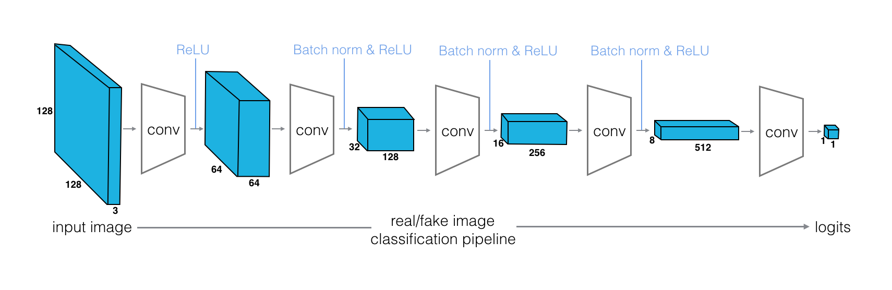
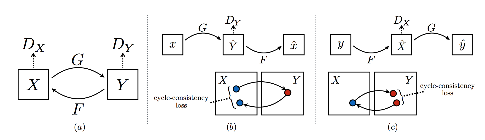

# Cycle-Consistent Adversarial Networks

See [**Jupyer notebook**](https://nbviewer.jupyter.org/github/jscriptcoder/CycleGANs/blob/master/CycleGAN_monet2photo.ipynb) for details about this project, hyperparameters and algorithms used.

This project is based on the paper: [Unpaired Image-to-Image Translation using Cycle-Consistent Adversarial Networks](https://junyanz.github.io/CycleGAN), and part of [Udacity Deep Learning Nanodegree program](https://www.udacity.com/course/deep-learning-nanodegree--nd101)

The goal is to train generators that learn to transform an image from domain **X** into an image that looks like it came from domain **Y** (and vice versa).

Examples:


## Unpaired Training Data

These images do not come with labels, but CycleGANs give us a way to learn the mapping between one image domain and another using an **unsupervised** approach. A CycleGAN is designed for image-to-image translation and it learns from unpaired training data. This means that in order to train a generator to translate images from domain **X** to domain **Y**, we do not have to have exact correspondences between individual images in those domains. For example, in the [paper that introduced CycleGANs](https://arxiv.org/abs/1703.10593), the authors are able to translate between images of horses and zebras, even though there are no images of a zebra in exactly the same position as a horse or with exactly the same background, etc. Thus, CycleGANs enable learning a mapping from one domain **X** to another domain **Y** without having to find perfectly-matched, training pairs!


## Architecture

A CycleGAN is made of two types of networks: **discriminators**, and **generators**. The discriminators are responsible for classifying images as real or fake (for both **X** and **Y** kinds of images). The generators are responsible for generating convincing, fake images for both kinds of images.

### Discriminator

The discriminators, `D_X` and `D_Y`, are convolutional neural networks that see an image and attempt to classify it as real or fake. In this case, real is indicated by an output close to 1 and fake as close to 0. The discriminators have the following architecture:



This network sees an image, and passes it through 5 convolutional layers that downsample the image by a factor of 2. The first four convolutional layers have a BatchNorm and ReLu activation function applied to their output, and the last acts as a classification layer that outputs one value.

#### Discriminator Implementation

```python
class Discriminator(nn.Module):
    
    def __init__(self, conv_dim=64):
        super(Discriminator, self).__init__()

        # Should accept an RGB image as input and output a single value
        
        self.conf_dim = conv_dim
        
        # 128x128x3
        self.conv1 = conv(in_channels=3, 
                          out_channels=conv_dim, 
                          kernel_size=4, 
                          batch_norm=False)
        # 64x64x64
        self.conv2 = conv(in_channels=conv_dim, 
                          out_channels=conv_dim*2, 
                          kernel_size=4)
        # 32x32x128
        self.conv3 = conv(in_channels=conv_dim*2, 
                          out_channels=conv_dim*4, 
                          kernel_size=4)
        # 16x16x256
        self.conv4 = conv(in_channels=conv_dim*4, 
                          out_channels=conv_dim*8, 
                          kernel_size=4)
        # 8x8x512
        self.conv5 = conv(in_channels=conv_dim*8, 
                          out_channels=1, 
                          kernel_size=4, 
                          stride=1, 
                          batch_norm=False)

    def forward(self, x):
        x = F.relu(self.conv1(x))
        x = F.relu(self.conv2(x))
        x = F.relu(self.conv3(x))
        x = F.relu(self.conv4(x))
        
        out = self.conv5(x)
        
        return out
```

### Generator
The generators, `G_XtoY` and `G_YtoX` (sometimes called **G** and **F**), are made of an **encoder**, a *conv* net that is responsible for turning an image into a smaller feature representation, and a **decoder**, a *transpose_conv* net that is responsible for turning that representation into an transformed image. These generators, one from XtoY and one from YtoX, have the following architecture:


This network sees an image, compresses it into a feature representation as it goes through three convolutional layers and reaches a series of residual blocks. It goes through a few (typically 6 or more) of these residual blocks, then it goes through three transpose convolutional layers (sometimes called *de-conv* layers) which upsample the output of the resnet blocks and create a new image!

Note that most of the convolutional and transpose-convolutional layers have BatchNorm and ReLu functions applied to their outputs with the exception of the final transpose convolutional layer, which has a `tanh` activation function applied to the output. Also, the residual blocks are made of convolutional and batch normalization layers.

#### Generator Implementation

```python
class CycleGenerator(nn.Module):
    
    def __init__(self, conv_dim=64, n_res_blocks=6):
        super(CycleGenerator, self).__init__()

        # 1. Encoder part of the generator
        
        # 128x128x3
        self.conv1 = conv(in_channels=3, out_channels=conv_dim, kernel_size=4)
        # 64x64x64
        self.conv2 = conv(in_channels=conv_dim, out_channels=conv_dim*2, kernel_size=4)
        # 32x32x128
        self.conv3 = conv(in_channels=conv_dim*2, out_channels=conv_dim*4, kernel_size=4)
        # 16x16x256

        # 2. Resnet part of the generator
        res_layers = []
        for _ in range(n_res_blocks):
            res_layers.append(ResidualBlock(conv_dim*4))
        
        self.res_blocks = nn.Sequential(*res_layers)

        # 3. Decoder part of the generator
        
        # 16x16x256
        self.deconv1 = deconv(in_channels=conv_dim*4, out_channels=conv_dim*2, kernel_size=4)
        # 32x32x128
        self.deconv2 = deconv(in_channels=conv_dim*2, out_channels=conv_dim, kernel_size=4)
        # 64x64x128
        self.deconv3 = deconv(in_channels=conv_dim, out_channels=3, kernel_size=4, batch_norm=False)

    def forward(self, x):
        x = F.relu(self.conv1(x))
        x = F.relu(self.conv2(x))
        x = F.relu(self.conv3(x))
        
        x = self.res_blocks(x)
        
        x = F.relu(self.deconv1(x))
        x = F.relu(self.deconv2(x))
        
        x = F.tanh(self.deconv3(x))

        return x
```

### Residual Blocks
The motivation for using residual blocks is as follows: very deep neural networks can be difficult to train. Deeper networks are more likely to have vanishing or exploding gradients and, therefore, have trouble reaching convergence; batch normalization helps with this a bit. However, during training, we often see that deep networks respond with a kind of training degradation. Essentially, the training accuracy stops improving and gets saturated at some point during training. In the worst cases, deep models would see their training accuracy actually worsen over time!

One solution to this problem is to use **Resnet blocks** that allow us to learn so-called residual functions as they are applied to layer inputs. You can read more about this proposed architecture in the paper, [Deep Residual Learning for Image Recognition](https://arxiv.org/abs/1512.03385) by Kaiming He et. al, and the below image is from that paper.

<p align="center"></p>

#### Residual Functions

Usually, when we create a deep learning model, the model (several layers with activations applied) is responsible for learning a mapping `M` from an input `x` to an output `y`:

`M(x) = y` 

Instead of learning a direct mapping from `x` to `y`, we can instead define a residual function:

`F(x) = M(x) - x`

This looks at the difference between a mapping applied to `x` and the original input, `x`. `F(x)` is, typically, two convolutional layers + normalization layer and a ReLu in between. These convolutional layers should have the same number of inputs as outputs. This mapping can then be written as the following; a function of the residual function and the input `x`. The addition step creates a kind of loop that connects the input `x` to the output `y`:

`M(x) = F(x) + x`  or `y = F(x) + x`

#### Optimizing a Residual Function

The idea is that it is easier to optimize this residual function `F(x)` than it is to optimize the original mapping `M(x)`. Consider an example; what if we want `y = x`? From our first direct mapping equation, `M(x) = y` , we could set `M(x) = x` but it is easier to solve the residual equation `F(x) = 0`, which, when plugged in to `y = F(x) + x`, yields `y = x`.


#### Residual Block Implementation

```python
class ResidualBlock(nn.Module):
    """
    Defines a residual block.
    This adds an input x to a convolutional layer (applied to x) with the same size input and output.
    These blocks allow a model to learn an effective transformation from one domain to another.
    """
    
    def __init__(self, conv_dim):
        super(ResidualBlock, self).__init__()
        
        # Two convolutional layers + batch normalization that will act as our residual function, F(x).
        # Layers should have the same shape input as output
        
        self.conv1 = conv(in_channels=conv_dim, 
                          out_channels=conv_dim, 
                          kernel_size=3, 
                          stride=1)
        
        self.conv2 = conv(in_channels=conv_dim, 
                          out_channels=conv_dim, 
                          kernel_size=3, 
                          stride=1)
        
    def forward(self, x):
        out = F.relu(self.conv1(x))
        out = x + self.conv2(out)
        
        return out
```

### Discriminator and Generator Losses

Computing the discriminator and the generator losses are key to getting a CycleGAN to train.



The CycleGAN contains two mapping functions: **G:X->Y** and **F:Y->X**, and associated adversarial discriminators **DY** and **DX**. (a) **DY**  encourages **G** to translate **X** into outputs indistinguishable from domain **Y**, and vice versa for **DX** and **F**.

To further regularize the mappings, we introduce two cycle consistency losses that capture the intuition that if we translate from one domain to the other and back again we should arrive at where we started. (b) Forward cycle-consistency loss and (c) backward cycle-consistency loss.

### Least Squares GANs

We've seen that regular GANs treat the discriminator as a classifier with the sigmoid cross entropy loss function. However, this loss function may lead to the vanishing gradients problem during the learning process. To overcome such a problem, we'll use a least squares loss function for the discriminator. This structure is also referred to as a least squares GAN or LSGAN, and you can read the original [paper on LSGANs](https://arxiv.org/abs/1611.04076). The authors show that LSGANs are able to generate higher quality images than regular GANs and that this loss type is a bit more stable during training.

#### Discriminator Losses

The discriminator losses will be mean squared errors between the output of the discriminator, given an image, and the target value, 0 or 1, depending on whether it should classify that image as fake or real. For example, for a real image, `x`, we can train **DX** by looking at how close it is to recognizing and image `x` as real using the mean squared error:

```python
out_x = D_X(x)
real_err = torch.mean((out_x-1)**2)
```

#### Generator Losses

Calculating the generator losses will look somewhat similar to calculating the discriminator loss; there will still be steps in which you generate fake images that look like they belong to the set of **X** images but are based on real images in set **Y**, and vice versa. You'll compute the "real loss" on those generated images by looking at the output of the discriminator as it's applied to these fake images; this time, your generator aims to make the discriminator classify these fake images as real images.

#### Cycle Consistency Loss

In addition to the adversarial losses, the generator loss terms will also include the cycle consistency loss. This loss is a measure of how good a reconstructed image is, when compared to an original image.

Say you have a fake, generated image, `x_hat`, and a real image, `y`. You can get a reconstructed `y_hat` by applying `G_XtoY(x_hat)` = `y_hat` and then check to see if this reconstruction `y_hat` and the orginal image `y` match. For this, we recommed calculating the L1 loss, which is an absolute difference, between reconstructed and real images. You may also choose to multiply this loss by some weight value lambda_weight to convey its importance.

<p align="center"></p>

The total generator loss will be the sum of the generator losses and the forward and backward cycle consistency losses.

## Training a CycleGAN

When a CycleGAN trains, and sees one batch of real images from set **X** and **Y**, it trains by performing the following steps:

**Training the Discriminators**

1. Compute the discriminator **DX** loss on real images
2. Generate fake images that look like domain **X** based on real images in domain **Y**
3. Compute the fake loss for **DX**
4. Compute the total loss and perform backpropagation and **DX** optimization
5. Repeat steps 1-4 only with **DY** and your domains switched!

**Training the Generators**

1. Generate fake images that look like domain **X** based on real images in domain **Y**
2. Compute the generator loss based on how **DX** responds to fake **X**
3. Generate reconstructed **Y** images based on the fake **X** images generated in step 1
4. Compute the cycle consistency loss by comparing the reconstructions with real **Y** images
5. Repeat steps 1-4 only swapping domains
6. Add up all the generator and reconstruction losses and perform backpropagation + optimization

## Monet paintings ⇄ Real photos

<p align="center">
  
  
  
</p>
